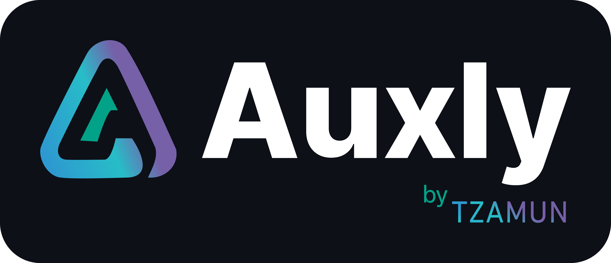

<div align="center">
  
  <h1>Auxly Skills</h1>
  <p><b>Plan with a multi-model council → review one vetted plan → execute it.</b><br/>
  Two small, stable agent skills that work together — or each on their own — across your AI coding CLIs.</p>

  <p>
    
    
    
    
  </p>
  <p><sub>Claude Code · Codex · Gemini CLI · Qwen · OpenCode · Kimi · Antigravity (agy) · Cursor</sub></p>
</div>

---

## What's inside

Two standalone skills. **Simple on purpose** — no web servers, no live dashboards, no background
daemons, nothing to keep in sync. (v1 had a live multi-stage Console; it was removed because the moving
parts caused more confusion than value. v2 keeps only what's stable and useful.)

| Skill | What it does |
|---|---|
| **`/auxly-llm-council`** | **Scans** your machine for installed model CLIs (Codex, Claude, Gemini, agy/Antigravity, kimi, qwen, OpenCode) and **asks which to include**. The chosen models each write an independent plan; the plans are anonymized, randomized, and merged by a Claude judge into **one vetted `final-plan.md`** plus a **self-contained, Auxly-branded `plan.html`** that opens in your browser for review — no server. No codex/gemini/agy installed? Falls back to a **Claude-only persona council** (architect + pragmatist + risk-hawk). |
| **`/auxly-execute`** | Claude works the accepted plan using its **native todo list** for live progress (the built-in, can't-get-stuck view) and keeps a short `PROGRESS.md`. Any decision or risky/irreversible step is surfaced as a clear question in chat. No dashboard, no scripts — pure instructions over Claude's own tools. |

All **pure Python standard library + a browser** for the council report. No third-party packages, no
network/CDN, logo embedded. Runs anywhere.

## The flow

```text
/auxly-llm-council   →  scan CLIs → you pick → council runs
                        → writes ./auxly-council/runs/<ts>/final-plan.md + plan.html (opens in browser)
review plan.html     →  back in Claude Code, reply:  execute  |  refine: <notes>  |  edit final-plan.md
/auxly-execute       →  Claude works the plan; progress shows in its native todo list + PROGRESS.md
```

## Install

### Option A — Claude Code plugin marketplace (Claude Code)
```text
/plugin marketplace add Tzamun-Arabia-IT-Co/auxly-skills
/plugin install auxly@auxly
```
`marketplace add` registers this repo as a source (reads `.claude-plugin/marketplace.json`);
`install auxly@auxly` installs the **`auxly`** plugin (both skills). Update later with
`/plugin update auxly@auxly`. **Versioning matters:** `/plugin` compares version numbers, so updates
only appear when the plugin version is bumped — current is **2.0.0**.

### Option B — one-shot `npx` (installs into every detected tool)
```bash
npx github:Tzamun-Arabia-IT-Co/auxly-skills              # install into all detected tools
npx github:Tzamun-Arabia-IT-Co/auxly-skills --dry-run    # preview, change nothing
npx github:Tzamun-Arabia-IT-Co/auxly-skills --uninstall  # remove everything
```
Needs Node + Python 3. Stages the suite into `~/.auxly-skills` and wires every detected agent CLI to it.

### Option C — clone + installer
```bash
git clone https://github.com/Tzamun-Arabia-IT-Co/auxly-skills.git ~/auxly-skills
cd ~/auxly-skills
./install.sh                 # detect every supported tool and wire it up
./install.sh --dry-run       # preview first (changes nothing)
./install.sh --claude-only   # just Claude Code
./install.sh --uninstall     # cleanly remove everything it added
```

**Supported tools** (auto-detected — only installed ones are touched): Claude Code / OpenCode / Qwen /
Kimi get native `/auxly-…` skills; Codex / Gemini CLI / Antigravity / Cursor get a small, reversible
instructions block (drive them by just asking). Restart a tool after installing so it rescans.

## Usage

You normally just **ask** — "plan this with the council", then "execute the plan".

- **Plan** — `/auxly-llm-council`: it scans your CLIs and asks which models to include, asks a few
  intake questions, runs the council, and opens `plan.html` for review. Have `codex` / `gemini` / `agy`
  for a multi-vendor council; otherwise it uses a Claude-only persona council automatically.
- **Review** — read `plan.html` in the browser, then reply in Claude Code: `execute`, `refine: <notes>`,
  or edit `final-plan.md` and say `execute`.
- **Execute** — `/auxly-execute`: Claude turns the plan into a todo list and works it, asking you in
  chat whenever a decision or an irreversible step comes up.

Council runs are saved under `./auxly-council/runs/<timestamp>/` in the working directory.

## Requirements
- Python 3.8+ and a browser (for the council's `plan.html`)
- Optional planner CLIs for the council: `codex`, `gemini`, `agy`, `kimi`, `qwen`, `opencode`
  (none required — it falls back to a Claude-only council)

## Repo layout
```
auxly-skills/
├─ .claude-plugin/marketplace.json     # plugin marketplace manifest
├─ plugins/auxly/
│  ├─ .claude-plugin/plugin.json
│  └─ skills/
│     ├─ auxly-llm-council/            # plan — multi-model council → final-plan.md + plan.html
│     │  └─ scripts/llm_council.py     #   the whole engine (one file, no server)
│     └─ auxly-execute/                # execute — instructions only (native todo list)
├─ install.sh                          # standalone (non-plugin) installer
├─ LICENSE                             # MIT
└─ README.md
```

## License
MIT — see [LICENSE](LICENSE).
